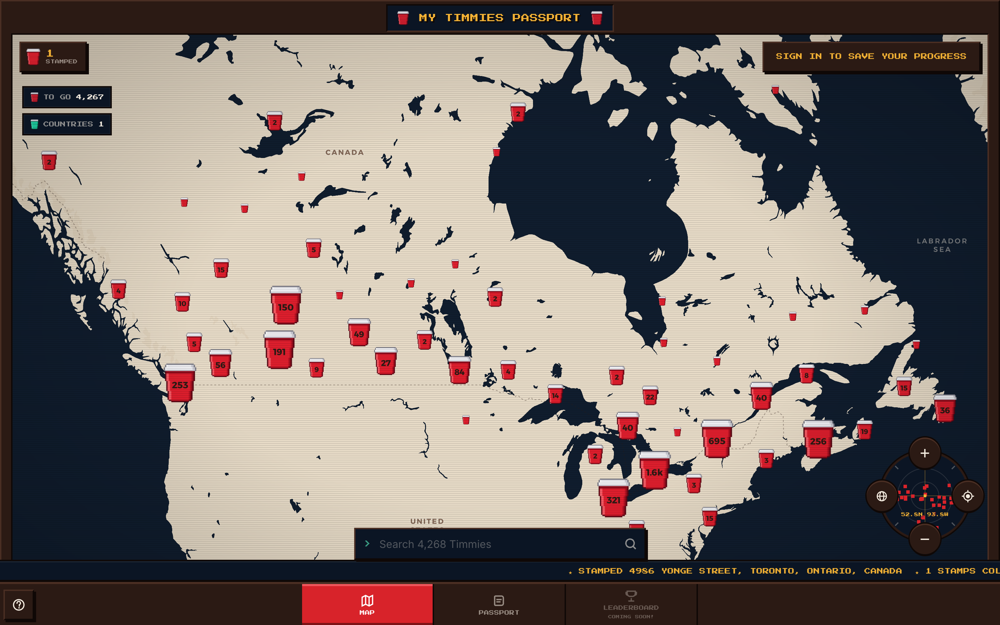

# ☕ My Timmies Passport!

Track every Tim Hortons in the world and collect the ones you've visited like
passport stamps. Local-first, delightful, and mobile-first.

**Live at [timmies-passport.pages.dev](https://timmies-passport.pages.dev)**

> Not affiliated with, endorsed by, or sponsored by Tim Hortons or Restaurant
> Brands International. "Tim Hortons" is their trademark, used here only to
> refer to their restaurants. Licences and attribution:
> [DATA-LICENSES.md](DATA-LICENSES.md).



- **Map of every Timmies** - 4,200+ locations harvested from OpenStreetMap, deduplicated, and clustered on a hand-styled MapLibre map.
- **Collect stamps** - tap a cup, check in with a pixel stamp animation, confetti, and haptics.
- **Works with no account** - everything lives in `localStorage`. Signing up syncs your stamps across devices.
- **Search cities or stores** - 1,300 cities rank above individual addresses; picking one frames every Timmies in it.
- **Your passport** - progress against the worldwide total, countries and regions visited, recent stamps with private notes.
- **Leaderboard** - the API and schema exist; the screen is marked coming soon.

## Tech

SvelteKit (Svelte 5 runes) · MapLibre GL · Cloudflare Pages/Workers · D1 (SQLite).
The app is a client-rendered SPA; the Cloudflare adapter also serves the API
routes (`src/routes/api/**`) and the optional cloud backend.

## Develop

```bash
npm install

# One-time: create the local D1 database (schema + 4.3k locations)
npm run db:migrate:local
npm run db:seed:local

npm run dev          # http://localhost:5173
```

Local dev uses `platformProxy`, so the D1 binding from `wrangler.toml` is
available to the API routes. Without D1 the app still runs fully local-first  - 
accounts/leaderboards just stay empty.

## Keeping the map current

```bash
npm run update:restaurants   # rebuild locations + gazetteer from both sources
npm run db:seed              # push the result to the remote D1
```

The updater is [`update-restaurants.ts`](update-restaurants.ts), at the repo
root because it is the one script you run by hand.

Monthly is about right - the brand locator behind it refreshes weekly.

Two sources, each doing what it is good at. **OpenStreetMap** says where stores
are and gives every record its stable id. **Tim Hortons' own store locator**,
via [All The Places](https://www.alltheplaces.xyz/) (CC0, rebuilt weekly), says
which ones exist: anything the chain no longer lists is closed, anything it
lists that we lack is added. OSM lags reality by months, which is why a store
that had quietly moved still showed as open.

Google Places was considered and rejected: it costs per request, and its terms
forbid persisting their content in a file like `static/locations.json`. The
brand's own list is free, storable, and more authoritative besides.

The locator only covers Canada, the US and the UK, so its silence is only
evidence there - a store in Jiangsu is not closed because a North American
locator has never heard of it.

`scripts/overrides.json` is the last word when both sources are wrong. Keep it
empty when they are not.

Safe to run ad-hoc or on a schedule. **The harvest never removes a location.**
Stamps live in each visitor's own browser keyed on the location id, so deleting
a row would quietly empty part of somebody's passport. A store that has
disappeared from OpenStreetMap, or been retagged `disused:`/`was:`, is kept and
marked `closed` instead: it still renders, greyed out, labelled "Permanently
closed", and anyone who collected it keeps it.

Each run reports what changed:

```
✓ merged with the shipped set: 3 added, 1 newly closed, 0 reopened, 15 closed in total
```

Closed stores are hidden on the map by default and enabled from the settings
button in the tab bar; one you have already stamped always shows, because it is
part of a passport.

A closure can also reverse itself - if OSM shows the store as active again the
flag clears. Visitors can flag a store from its card ("Report"), which opens an
issue with the id and coordinates filled in; OpenStreetMap lags reality, so a
human is often the first signal that a location is gone or misplaced.

## Deploy to Cloudflare

Live at **https://timmies-passport.pages.dev** (Pages project `timmies-passport`,
D1 database `timmies-passport-db`).

```bash
npm run build
npx wrangler pages deploy .svelte-kit/cloudflare --project-name=timmies-passport
```

The D1 binding comes from `wrangler.toml`, so deployments pick it up
automatically. After re-harvesting locations, push them to the remote DB:

```bash
npm run db:migrate   # only when migrations/ changes
npm run db:seed      # reload the locations table
```

Note that `static/locations.json` is what the map reads, and Pages serves it
straight from the CDN. D1 is only needed for accounts, cloud sync and global
check-in counts - the app is local-first and works without it.

First-time setup in a fresh account:

```bash
npx wrangler login
npx wrangler d1 create timmies-passport-db   # paste database_id into wrangler.toml
npx wrangler pages project create timmies-passport --production-branch=main
```

### In-app reporting

The report form files a GitHub issue directly, so a reporter never needs an
account.
Every issue is opened by the token's owner and the body is marked as filed
anonymously through the app - nothing about the reporter is attached beyond the
browser string, which is what makes a rendering bug reproducible.

Create a **fine-grained personal access token** scoped to this repository only,
with the single permission **Issues: read and write**.
Nothing else - if it leaks, the worst it can do is open issues.

```bash
npx wrangler pages secret put GITHUB_TOKEN   # the token
npx wrangler pages secret put GITHUB_REPO    # JYoussouf/Timmies-Passport
```

Reports are capped at five per IP per hour, tracked in the `reports` table as a
salted hash and a timestamp - no addresses and no report text, since the
reports themselves live in GitHub.
Run `npm run db:migrate` once to create it.

Without the secrets the endpoint answers 503 and the form offers a prefilled
link to the issue tracker instead, so a report always has somewhere to go.

### Street View

The card's Street View panel uses Google's **Maps Embed API**, which is the
supported way to embed it. Street View is one of the Embed API's free modes, so
this is a key rather than a bill - but confirm on Google's pricing page and set
a budget alert anyway, since only they get to change that.

1. In the Google Cloud console, create a project and **enable the Maps Embed
   API**.
2. Create an API key, then **restrict it**: application restriction "Websites",
   allowing only your own origins, and API restriction to the Maps Embed API.
   The key travels in the iframe URL and is therefore public, so the referrer
   restriction is what stops anyone else spending it.
3. Set it where the app is built:

```bash
echo 'PUBLIC_GOOGLE_MAPS_KEY="your-key"' >> .env      # local
npx wrangler pages secret put PUBLIC_GOOGLE_MAPS_KEY  # deployed
```

Without a key the panel is not offered at all, rather than falling back to
Google's undocumented keyless embed endpoint, which works but sits outside
their terms. "Open in Maps" is unaffected either way - linking out needs no
key.

## Project map

| Path | What |
| --- | --- |
| `update-restaurants.ts` | the monthly updater: Overpass + brand locator + geocoding |
| `scripts/overrides.json` | hand corrections, when both sources are wrong |
| `src/lib/stores/*.svelte.ts` | local-first passport, locations index, auth, UI |
| `src/lib/components/` | Cabinet, MapView, Compass, SearchDock, LocationSheet, … |
| `src/lib/styles/arcade.css` | design tokens + primitives (`plate`, `pbtn`, `chip`, `veil`) |
| `src/lib/map/style.ts` | hand-rolled tracker basemap style |
| `src/lib/map/sprites.ts` | pixel-art marker sprites, built as raw RGBA |
| `src/lib/art/cup.ts` | the cup artwork as a pixel grid, shared by map and UI |
| `src/routes/api/**` | locations, visits, auth, leaderboard endpoints |
| `migrations/0001_init.sql` | D1 schema |

## Design notes

The UI is a retro arcade cabinet: dark-only, zero border-radius, depth from
stepped unblurred shadows rather than blur.
`Press Start 2P` (self-hosted, no CDN) is used for chrome only - HUD, headings,
nav, buttons - while Inter carries every piece of body copy, because pixel type
is unreadable at paragraph length.

- The cabinet frame **dissolves rather than shrinks** below 900px.
  Chrome that costs vertical space is dropped on mobile, not miniaturised: the
  border collapses to a hairline, the title plate and stats rail disappear, and
  the tab bar goes full-width above `env(safe-area-inset-bottom)`.
- The basemap is our own `StyleSpecification` over CARTO's free vector tiles, so
  the map reads as a flat tracker screen: cream landmass, deep navy water,
  dotted borders, and no street detail until you are close enough to walk there.
- Markers are literal pixel grids upscaled with nearest-neighbour
  (`map.addImage` at `pixelRatio: 2`), which keeps them chunky at any DPI
  instead of resolving into smooth antialiased circles.
- **Global counts** only increment for *authenticated* check-ins, keeping "N
  others here" meaningful and abuse-resistant. Anonymous check-ins stay local
  until you sign up and sync.
- Every store is named "Tim Hortons", so lists lead with the **street address**;
  the name alone produces a wall of identical rows.
- Animations respect `prefers-reduced-motion`, which also disables the scanline
  veil and freezes the marquee and the selection reticle.
